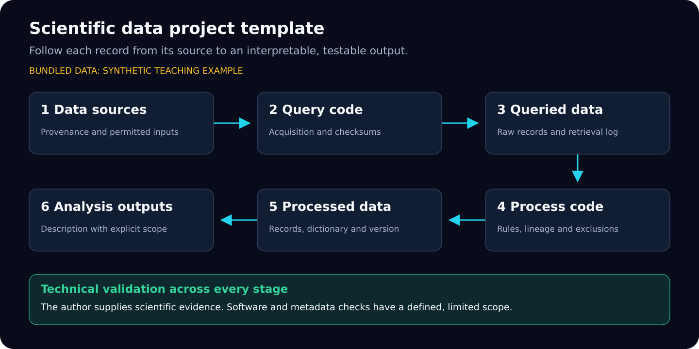

# Oracle4SD

**A reusable scientific data project template for first-time student first authors.**

This repository provides the folders, code, documentation and review evidence needed to
start a Scientific Data project. Its eight invented observations demonstrate an entire
workflow. They are not Oracle research data or publication findings.
Real projects require their own sources, permissions, methods and scientific validation.

[Quick start](#quick-start) · [Folders](#folders) · [First-author tasks](#author-tasks) ·
[Requirements](docs/REQUIREMENTS.md) · [Hugging Face](docs/HUGGING_FACE.md) · [Validation](docs/VALIDATION_STATUS.md)

## Quick start

Use Python 3.12. The teaching pipeline needs no third-party packages or credentials.

~~~bash
git clone https://github.com/sunshineluyao/Oracle4SD.git
cd Oracle4SD
python scripts/check_template.py
python -m unittest discover -s tests -v
python scripts/run_pipeline.py
~~~

The last command creates a new directory under runs/, performs all four code stages offline,
and checks deterministic outputs against the bundled reference.
Expected teaching output: **6 processed records, 1 missing value, 5 numeric values,
mean 14.0000 degrees Celsius**. It removes one exact duplicate and one deliberately
out-of-range record. These are software demonstrations, not empirical claims.
Scientific validity remains explicitly **not evaluated**.

For Colab, open the badge above. For real projects, complete the
[eight-part authoring notebook](notebooks/Scientific_Data_Colab_Tutorial_Template.ipynb).
It deliberately requires author inputs before accessing project data.

## Folder map

| Folder | What belongs here |
|---|---|
| [data/data_source](data/data_source/README.md) | Sources, acquisition protocols, source metadata and permitted original files |
| [data/queried_data](data/queried_data/README.md) | Acquired raw bytes, provenance and checksums |
| [data/processed_data](data/processed_data/README.md) | Processed records, schema and release manifest |
| [code/query_data](code/query_data/README.md) | Query/download implementation |
| [code/process_data](code/process_data/README.md) | Transformation and lineage implementation |
| [code/analyze_data](code/analyze_data/README.md) | Reproducible descriptive or research analyses |
| [code/technical_validation](code/technical_validation/README.md) | Technical checks and project-specific validity studies |
| [metadata](metadata/README.md) | Source register, dictionary, claim/validation worksheets and Croissant template |
| [notebooks](notebooks/README.md) | Runnable example and general author tutorial |
| [templates](templates/README.md) | Project/data/code README and Hugging Face Dataset Card templates |
| [paper](paper/README.md) | Section-by-section manuscript instructions |
| [reports](reports/README.md) | Example evidence and project report instructions |
| [configs](configs/README.md) | Example and project configuration/packaging templates |
| [tests](tests/README.md) | Software, negative-path and reference-comparison tests |

The [machine-readable result map](metadata/result_index.demo.json) connects sources →
query code → queried data → processing code → processed data → analysis outputs.
The [reproduction guide](docs/REPRODUCIBILITY.md) provides exact commands and evidence scope.

## First-author tasks

1. Read the [first-author guide](docs/FIRST_AUTHOR_GUIDE.md) and
   [requirements map](docs/REQUIREMENTS.md). Set the project's three internal milestones.
2. Copy [the project README template](templates/PROJECT_README.md), complete the registers
   in metadata/, and replace the teaching adapters with justified scientific methods.
3. Reconcile the manuscript, dictionary, release files and notebook; obtain an independent
   reproduction; prepare the [Hugging Face bundle](docs/HUGGING_FACE.md) from an explicit
   file allowlist.

Each folder README explains author inputs, expected outputs, completion checks and its
direct official-source links. Large or restricted project files remain external unless
deliberately approved for inclusion; record their immutable locations and hashes.

## Requirements, access and reuse

The instructions cite [Scientific Data](https://www.nature.com/sdata/submission-guidelines),
[NeurIPS 2026 E&D](https://neurips.cc/Conferences/2026/CallForEvaluationsDatasets) and its [dataset hosting requirements](https://neurips.cc/Conferences/2026/EvaluationsDatasetsHosting).
NeurIPS-specific expectations are identified separately from journal requirements.
Recheck the actual submission year. A completed template or valid metadata does not guarantee acceptance.

The existing [MIT licence](LICENSE) covers code, documentation and bundled synthetic
teaching material. Real datasets need their own documented rights and licence.
Use [CITATION.cff](CITATION.cff) for this software template and cite research data separately.
See [contribution instructions](CONTRIBUTING.md) and [known validation scope](docs/VALIDATION_STATUS.md).

To reuse the repository, use GitHub's template function once enabled, or copy it into a
new repository. [Repository setup instructions](docs/REPOSITORY_SETUP.md) explain this setting.
